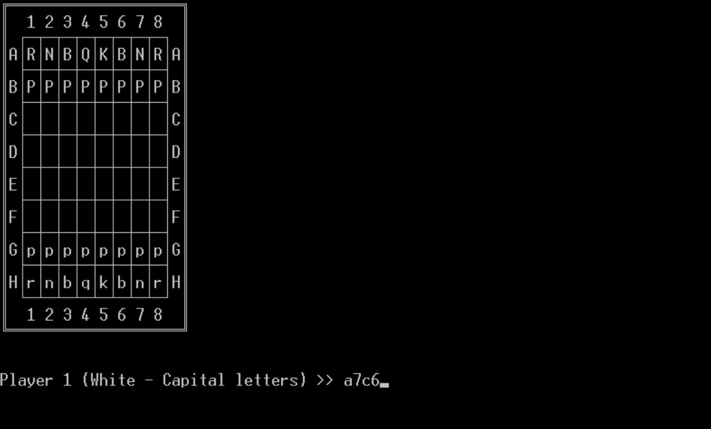

# Simple Chess Game
## Table of Contents

•⁠  ⁠[Introduction](#introduction)
•⁠  ⁠[Installation](#installation)
•⁠  ⁠[How to Run](#how-to-run)
•⁠  ⁠[Playing the Game](#playing-the-game)
•⁠  ⁠[Project Structure](#project-structure)
•⁠  ⁠[Acknowledgements](#acknowledgements)

## Introduction

This C++ implementation offers a chess game adhering to standard rules, allowing two players to take turns moving pieces on a board. The game operates within a terminal window environment, leveraging a factory design pattern and featuring a simple GUI experience within the terminal.

## Note:
Currently, this game is only compatible with Windows OS. Support for other operating systems will be added in future updates.

## Installation

### Prerequisites:

 1.⁠ ⁠*C++ Compiler:* Ensure you have a C++ compiler installed on your system. Common ones include GCC (GNU Compiler Collection) for Unix-based systems or MinGW for Windows.

### Steps to Install:

 1.⁠ ⁠*Clone the Repository:* Clone the repository containing the chess game onto your local machine.

   ⁠ bash
   git clone https://github.com/your_username/chess_game.git
    ⁠
   Navigate to Project Directory: Open a terminal or command prompt and navigate to the directory where the project files are located.
# How to Run
### Compile and run the excutable:
⁠ bash
g++ main.cpp -o chess_game
 ./chess_game
  ⁠
# Playing the Game

Once the game is launched, follow the instructions provided within the game's interface to make moves. Enter the starting and ending coordinates for the pieces you wish to move, following the specified format.

Valid moves update the board and switch to the other player's turn. Invalid moves prompt an error message for re-entry.

The game concludes when one player puts the other's king in checkmate, determining the winning player.

## Game Progress

### Player 1 First Move

### Movement was Legal, Now Player 2 Move

# Project Structure
The project comprises several files:

•⁠  ⁠⁠ Board.h ⁠: Contains the ⁠ Board ⁠ class, representing the chess board.
•⁠  ⁠⁠ Piece.h ⁠: Includes the ⁠ Piece ⁠ class, depicting a chess piece.
•⁠  ⁠⁠ PieceFactory.h ⁠: Manages the creation of ⁠ Piece ⁠ instances.
•⁠  ⁠⁠ Pawn.h ⁠, ⁠ Knight.h ⁠, ⁠ Bishop.h ⁠, ⁠ Rook.h ⁠, ⁠ Queen.h ⁠, ⁠ King.h ⁠: Represent various chess piece classes.
•⁠  ⁠⁠ main.cpp ⁠: Hosts the main function to execute the game.

# Acknowledgements
This game was created as part of the C++ Advanced course at HAC by Noam Mirjani.